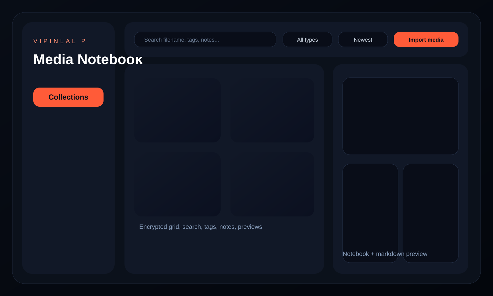

# Media Notebook

Media Notebook is a secure, local-first desktop application for organizing images, videos, and PDF documents in an encrypted personal vault. It pairs a Netflix-style browsing experience with notebook-style annotations, fast SQLite-backed search, thumbnail caching, and secure export flows.



## Features

- Electron desktop application with React, TypeScript, and TailwindCSS
- AES-256-GCM encrypted media storage
- PBKDF2-SHA512 password derivation with in-memory session keys only
- SQLite metadata catalog for media, tags, collections, favorites, and notes
- Drag-and-drop import plus native file-picker import
- Secure decrypted export
- Grid and list views with search, filter, and sort controls
- Image preview, video playback, and PDF preview
- Markdown notebook editing with live rendered preview
- Thumbnail caching and lazy image loading
- Strict TypeScript, ESLint, Prettier, logging, and backend crypto tests

## Tech Stack

- Desktop runtime: Electron
- Frontend: React 19, TypeScript, Vite, TailwindCSS
- Backend: Node.js with Electron main/preload processes
- Storage: SQLite via `better-sqlite3`
- Imaging: Jimp thumbnail generation
- Notes rendering: marked

## Project Structure

```text
.
├── backend/          # Electron main process, preload bridge, services, DB, tests
├── frontend/         # React renderer, Tailwind styles, UI components
├── shared/           # Shared renderer/backend contracts
├── seed/             # Example media assets for smoke tests
└── docs/assets/      # Mock screenshots and documentation assets
```

## Installation

### Prerequisites

- Node.js 24+
- npm 11+

### Install dependencies

```bash
npm install
```

## Development

```bash
npm run dev
```

## Build

```bash
npm run build
npm run package
```

- `npm run build` runs linting, backend tests, and production builds.
- `npm run package` generates Electron distributables in `release/`.

## Seed Data

Import the files in `seed/media` after you unlock the vault:

- `aurora-poster.svg`
- `coral-card.svg`
- `studio-note.pdf`

## Security Notes

- Media files are encrypted locally with AES-256-GCM before they are stored in the vault.
- The vault password is stretched with PBKDF2-SHA512 using 210,000 iterations.
- The app stores only a verifier and salt. Plaintext encryption keys are never persisted.
- Decrypted previews are generated on demand in a temporary preview cache and removed when the vault locks.
- Export writes a decrypted copy only to a user-chosen destination.

## Testing

```bash
npm test
```

Automated tests currently validate:

- key derivation stability
- verifier consistency
- encrypted buffer round-tripping
- encrypted file round-tripping

## Note On Framework Choice

The original preference was Tauri. This implementation uses Electron because the validated local environment included Node.js but did not include a Rust toolchain, and Electron is the approved alternative in the specification.
